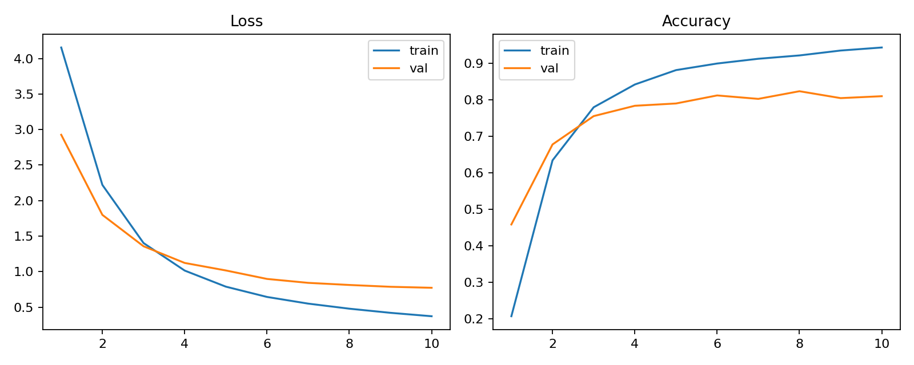
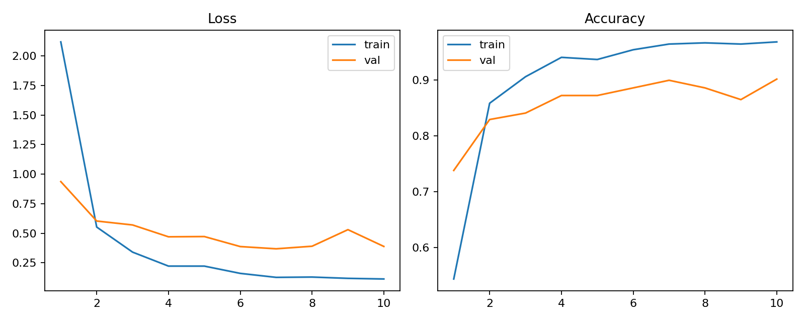
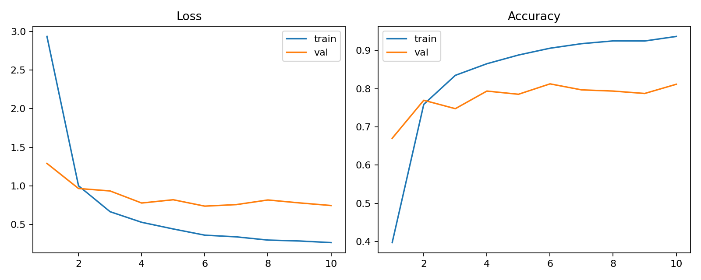
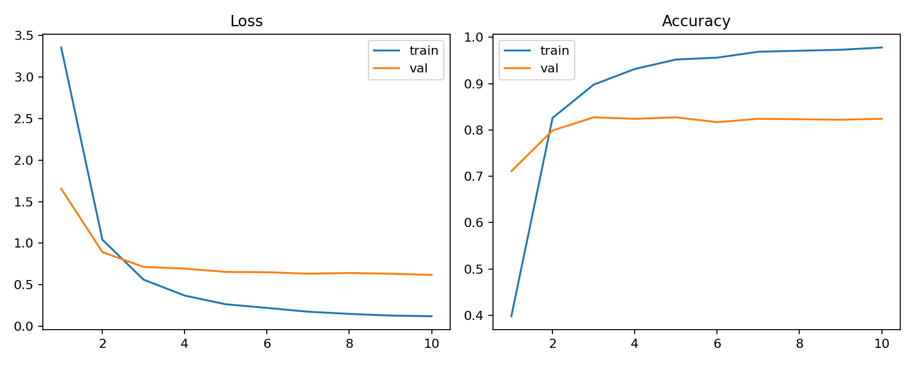
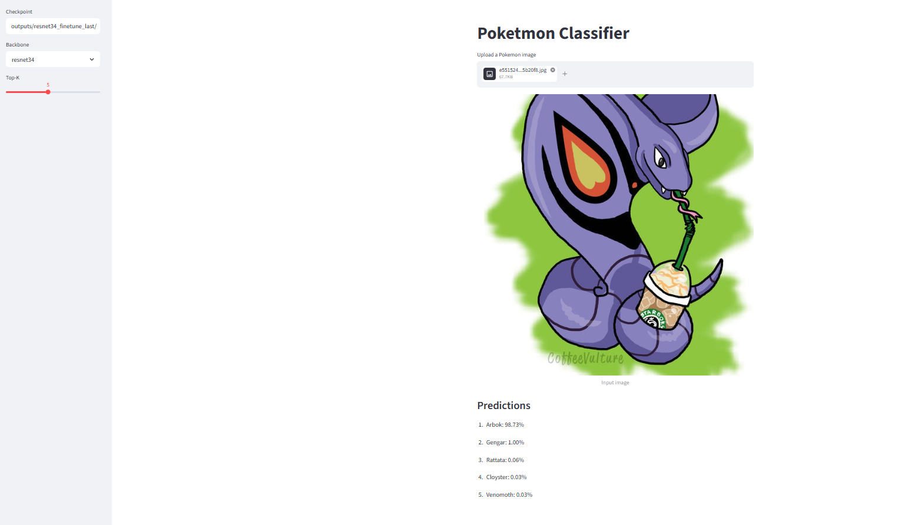

# Poketmon Classifier

전이학습(Transfer Learning)을 이용한 포켓몬 이미지 분류 프로젝트입니다. 포켓몬 이미지를 입력하면 학습된 CNN 모델이 포켓몬 이름을 예측합니다.

## 개요

이 프로젝트는 PyTorch 기반 이미지 분류 모델과 Streamlit 데모 GUI로 구성되어 있습니다. ImageNet으로 사전학습된 CNN backbone을 활용하여 적은 데이터에서도 안정적인 분류 성능을 얻는 것을 목표로 합니다.

주요 기능은 다음과 같습니다.

- PyTorch 기반 포켓몬 이미지 분류 모델 학습
- ImageNet 사전학습 가중치를 활용한 transfer learning
- 여러 CNN backbone 실험 비교
- test accuracy, precision, recall, F1-score 저장
- learning curve 이미지 저장
- Streamlit 기반 데모 GUI 제공

## 프로젝트 구조

```text
poketmon-calssifier/
├── app.py
├── requirements.txt
├── README.md
├── configs/
│   └── experiments.yaml
├── data/
│   ├── PokemonData/
│   └── .gitkeep
├── outputs/
│   └── .gitkeep
└── src/
    ├── dataset.py
    ├── evaluate.py
    ├── model.py
    ├── split_dataset.py
    ├── train.py
    └── utils.py
```

## 데이터셋

사용 데이터셋: https://www.kaggle.com/datasets/lantian773030/pokemonclassification

- Pokemon image dataset
- 클래스별 폴더 구조
- 예시 경로: `data/PokemonData`

현재 원본 데이터셋 구조는 다음과 같습니다.

```text
data/PokemonData/
├── Abra/
├── Aerodactyl/
├── Alakazam/
├── Bulbasaur/
├── Charmander/
└── ...
```

학습 코드는 `train`, `val`, `test`로 나뉜 구조를 사용합니다. 따라서 먼저 데이터셋을 분할해야 합니다.

```bash
python src/split_dataset.py --source data/PokemonData --target data/pokemon
```

분할 후에는 다음 구조가 생성됩니다.

```text
data/pokemon/
├── train/
│   ├── Abra/
│   ├── Aerodactyl/
│   └── ...
├── val/
│   ├── Abra/
│   ├── Aerodactyl/
│   └── ...
└── test/
    ├── Abra/
    ├── Aerodactyl/
    └── ...
```

## 설치 방법

```bash
pip install -r requirements.txt
```

## 실험 구성

다양한 backbone과 fine-tuning 범위를 비교하기 위해 다음 실험을 구성했습니다.

| 실험 이름 | Backbone | Pretrained | Fine-tuning 범위 | Epoch |
|---|---:|---:|---|---:|
| `resnet18_head_only` | ResNet18 | 사용 | classifier head만 학습 | 10 |
| `resnet34_finetune_last` | ResNet34 | 사용 | 마지막 residual block + head 학습 | 10 |
| `mobilenet_head_only` | MobileNetV3-Small | 사용 | classifier head만 학습 | 10 |
| `efficientnet_finetune_last` | EfficientNet-B0 | 사용 | 마지막 feature block + head 학습 | 10 |

실험 설정 파일은 `configs/experiments.yaml`에 있습니다.

## 학습 방법

하나의 실험을 학습하려면 다음 명령어를 실행합니다.

```bash
python src/train.py --config configs/experiments.yaml --experiment resnet18_head_only
```

나머지 실험도 다음과 같이 실행합니다.

```bash
python src/train.py --config configs/experiments.yaml --experiment resnet34_finetune_last
python src/train.py --config configs/experiments.yaml --experiment mobilenet_head_only
python src/train.py --config configs/experiments.yaml --experiment efficientnet_finetune_last
```

학습 결과는 `outputs/<실험 이름>/` 폴더에 저장됩니다.

```text
outputs/<experiment_name>/
├── best_model.pt
├── class_names.json
├── history.csv
├── learning_curve.png
└── metrics.json
```

## 평가 방법

`train.py`는 학습이 끝난 뒤 test set 평가를 자동으로 수행하고, 요약 성능을 `metrics.json`에 저장합니다.

```text
outputs/<실험 이름>/metrics.json
```

따라서 README의 실험 결과 표는 각 실험 폴더의 `metrics.json` 값을 사용하여 채우면 됩니다.

## 데모 GUI 실행

Streamlit 데모를 실행합니다.

```bash
streamlit run app.py
```

데모 화면에서 학습된 checkpoint 경로를 선택하고 테스트 이미지를 업로드하면 Top-K 예측 결과를 확인할 수 있습니다.

예시 checkpoint 경로:

```text
outputs/resnet18_head_only/best_model.pt
```

## 실험 결과

학습 완료 후 `outputs/<실험 이름>/metrics.json` 값을 확인하여 아래 표를 채웁니다.

| 실험 이름 | Test Accuracy | Test Precision | Test Recall | Test F1 |
|---|---:|---:|---:|---:|
| `resnet18_head_only` | 0.8034 | 0.8361 | 0.7981 | 0.7983 |
| `resnet34_finetune_last` | 0.8879 | 0.9085 | 0.8849 | 0.8850 |
| `mobilenet_head_only` | 0.8198 | 0.8495 | 0.8165 | 0.8137 |
| `efficientnet_finetune_last` | 0.8164 | 0.8331 | 0.8096 | 0.8084 |

가장 높은 성능을 보인 모델은 `resnet34_finetune_last`입니다. Test accuracy 0.8879, macro F1-score 0.8850으로 네 가지 실험 중 가장 안정적인 결과를 보였습니다. ResNet34의 마지막 residual block과 classifier head를 함께 fine-tuning한 설정이 head만 학습한 모델보다 더 좋은 성능을 보였습니다.

## 예시 결과

### Learning Curve

각 실험의 학습 곡선입니다.

#### ResNet18 Head Only



#### ResNet34 Fine-tune Last Block



#### MobileNetV3 Head Only



#### EfficientNet-B0 Fine-tune Last Block



### Demo GUI

Streamlit을 이용하여 테스트 이미지를 업로드하고 Top-5 예측 결과를 확인할 수 있습니다.

데모 화면에서는 가장 성능이 좋았던 `resnet34_finetune_last` 모델을 사용했습니다.

```text
Checkpoint: outputs/resnet34_finetune_last/best_model.pt
Backbone: resnet34
Top-K: 5
```

<br>

